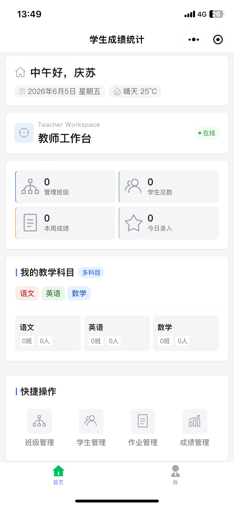
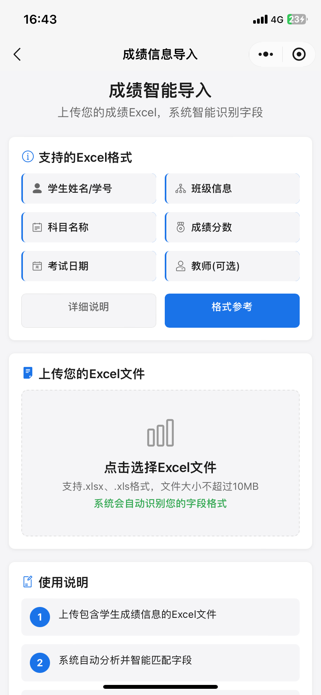
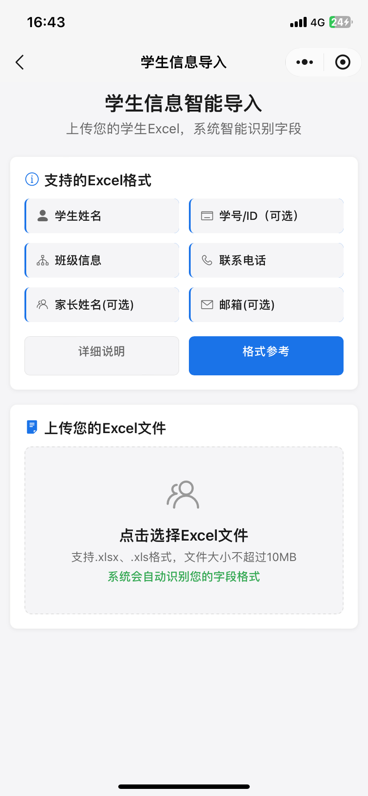

# 轻成绩 · 学生成绩管理系统

基于微信云开发的教育管理小程序，支持教师、家长、管理员三种角色，提供成绩记录、班级管理、作业管理、Excel 批量导入与数据可视化分析。

适用于中小学校、培训机构及教育团队。无需自建服务器，基于微信云开发部署，完成基本配置后可提交审核上线。

---

## 项目现状

| 项目 | 说明 |
|------|------|
| 版本 | v1.0 |
| 最后更新 | 2026 年 6 月 |
| 完成度 | 核心功能已完成，部分扩展功能（数据导出、消息推送）尚未实现，文档中已标注 |
| 许可 | 商业授权源码，可商用、可二次开发，不可直接转售源码 |

---

## 核心功能

### 教师端

- **仪表盘**：班级数、学生数、本周/今日录入成绩数实时统计等
- **班级管理**：创建、编辑、删除班级，支持批量升级
- **学生管理**：学生档案录入，支持 Excel 批量导入，按姓名/班级搜索
- **成绩管理**：手动录入或 Excel 批量导入，多科目支持，含 ECharts 成绩趋势图、分布图、优秀率统计
- **作业管理**：发布作业、在线批改评分、查看完成率统计

### 家长端

- 查看绑定孩子的各科成绩及历次成绩趋势对比
- 查看作业列表与批改结果
- 支持同时关联多个孩子

### 管理员端

- 教师申请审核与科目/班级权限分配
- 全局班级、学生、成绩数据管理
- 多科目配置
- 账户注销申请审核（软删除/硬删除，48 小时冷静期）

---

## 技术信息

| 项目 | 说明 |
|------|------|
| 前端 | 微信小程序原生开发，29 个页面，16 个组件 |
| 后端 | 微信云开发，Node.js 12，70+ 云函数 |
| 数据库 | 云数据库，12 个集合 |
| 图表 | ECharts 微信小程序版 |
| Excel 处理 | XLSX.js 前端解析 |

---

## 数据库集合

| 集合名称 | 用途 |
|----------|------|
| `user` | 用户账户与角色 |
| `students` | 学生档案 |
| `classes` | 班级信息 |
| `scores` | 成绩记录 |
| `subjects` | 科目配置 |
| `homework` | 作业内容 |
| `homework_submissions` | 作业提交记录 |
| `parent_students` | 家长与学生关联 |
| `teacher_subjects` | 教师科目关联 |
| `teacher_applications` | 教师申请 |
| `user_deletion_requests` | 账户注销申请 |
| `data_deletion_logs` | 删除操作日志 |

---

## 部署要求

- 微信开发者工具（最新版）
- 已认证的微信小程序账号
- Node.js ≥ 12.x
- 微信基础库 ≥ 3.10.0
- 腾讯云账号（需开通云开发）

---

## 部署步骤

**第一步：配置项目信息**

- 在 `project.config.json` 中替换你的小程序 AppID
- 在 `miniprogram/app.js` 中填入云开发环境 ID

**第二步：创建数据库集合**

在云开发控制台手动创建上表中的 12 个集合，并将权限设置为"仅创建者及管理员可读写"（成绩、学生等敏感集合）。

**第三步：上传云函数**

在微信开发者工具中，右键 `cloudfunctions` 文件夹，选择"上传并部署：云端安装依赖"。等待全部云函数部署完成。

**第四步：配置隐私协议**

参考 `PRIVACY_SETUP_GUIDE.md` 完成以下操作：
- 在 `pages/privacy-policy/index.wxml` 中修改联系方式（2 处）
- 在微信小程序后台配置隐私保护指引并勾选所用隐私接口

**第五步：测试与上线**

使用测试账号验证教师端、家长端、管理员端核心流程，确认无误后提交微信审核。

> 完整部署文档（含数据库权限配置、常见部署问题）随购买源码一并提供。

---

## 隐私合规

本项目已内置合规相关实现：

- 隐私协议页面（`pages/privacy-policy/index`）
- `app.json` 中已配置 `__usePrivacyCheck__`，首次使用时微信自动弹出同意框
- 账户注销功能（软删除/硬删除，48 小时冷静期，影响分析提示）
- 操作审计日志

购买后只需修改隐私协议中的联系方式，并在微信小程序后台完成配置。详见 `PRIVACY_SETUP_GUIDE.md`。

---

## 功能截图

教师端仪表盘：

成绩导入：

学生批量导入：

更多截图见 [/screenshots](/screenshots)。

---

## 文档索引

| 文档 | 说明 |
|------|------|
| [PURCHASE.md](PURCHASE.md) | 功能说明、交付内容、版本与价格、FAQ |
| [PRIVACY_SETUP_GUIDE.md](PRIVACY_SETUP_GUIDE.md) | 隐私协议配置操作步骤 |
| [PRIVACY_POLICY.md](PRIVACY_POLICY.md) | 隐私保护指引模板（供部署后填入小程序后台） |

---

## 联系方式

- 微信：19969250783（请备注来意）
- 邮箱：569070485@qq.com
- 工作时间：周一至周六 9:00–21:00

如需体验演示版，请通过以上方式联系，作者会提供体验码（仅对有意购买者开放）。

---

© 2025 轻成绩 · 学生成绩管理系统 v1.0
